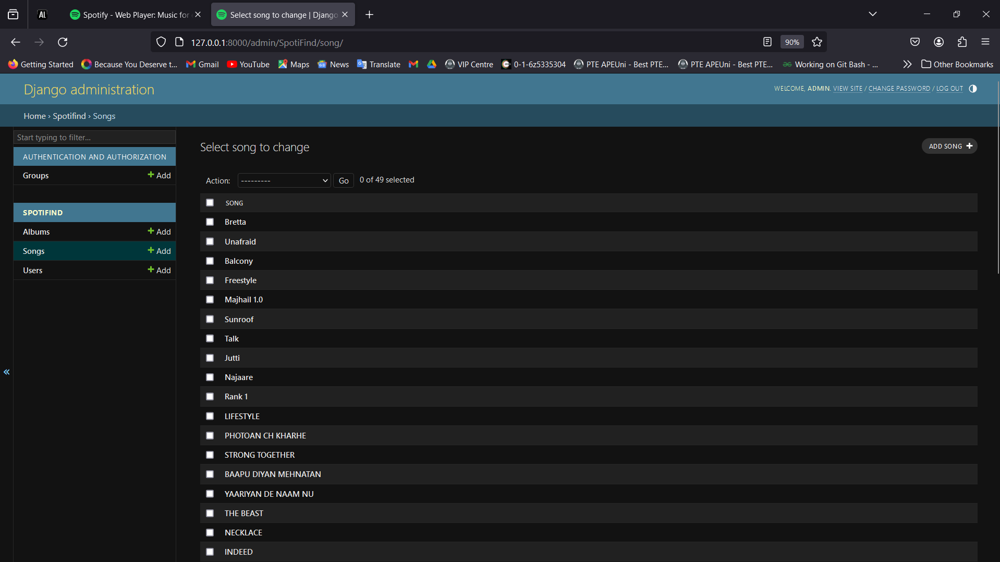
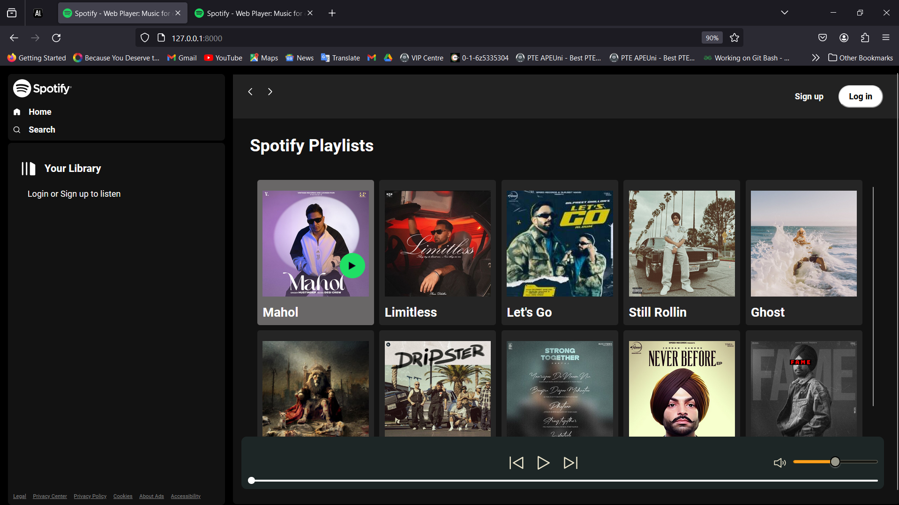
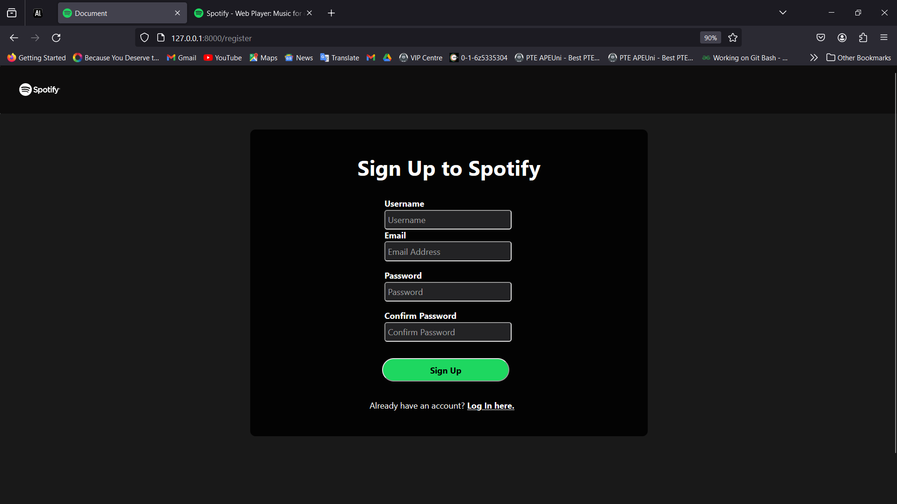
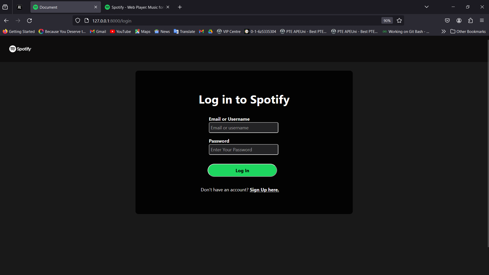
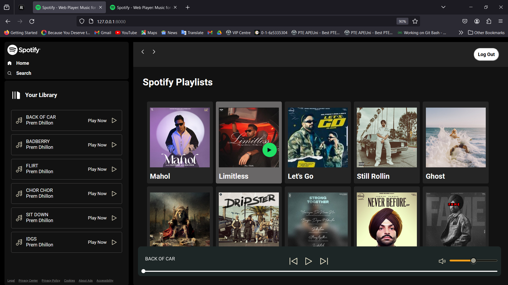

## Spotify web clone (Django)

Welcome to my Spotify clone website repository! This website is  very similar to Spotify web (https://open.spotify.com/) and this is a music player app. There are some albums and songs related to their albums. This is also mobile responsive. 

## Distinctiveness and Complexity

This project is both distinctive and complex compared to other projects. Because this is a music player app where we can upload albums of songs . The User Interface is very similar to official spotify web (https://open.spotify.com/). In this project, at home page all albums are displayed and whenever a user clicks an album then (with the help of javascript) it loads all the songs of an album. It loads all songs of an album without requiring a reload to entire page in your library. On right top there are two buttons signup and login (). if user clicks signup then user will be redirect to signup page  and if user clicks login then user will be redirect to login page . After login user will be able to load all songs of an album and user can play them. In an album if current song is over then next song will be played automatically. And there is a seek bar in bottom, where user can see song duration. And there are three buttons previous, play, next user can use these buttons to play and pause the songs, play next and previous song. Also user can play any song by clicking on any in your library . There are some more Features in this project which makes this project both distinctive and complex compared to other projects. [For more (https://youtu.be/N4HdbQ4o9nQ)]

## File Structure

*README.md*: This file provides an overview of the project, including how to run the application and other additional information.
*main.py*: This is the main script that runs the application.
*SpotiFind*: This is an app of this project.
*static/SpotiFind*: This is a static files folder where you can find all static files like:*css*, *img*, *js*.
*css*: In this you can find all css file. 
*img*: In this you can find all Svg or jpg files which are used in this project.
*js*: In this you can find javascript file of this project.
*templates/SpotiFind*: This is a template files folder where you can find all template files like:*index.html*, *layout.html*, *login.html* *Signup.html*.
*urls.py*: This urls file this helps to perform url dispatching task.
*models.py*: By using this file you can create tables in the database by using classes like:*User*, *Album*, *Song*.
*admin.py*: This file helps to register our models in Django admin site.
*apps.py*: This file helps to register app in the project.
*views.py*: All the functions which helps to intract with database could be found.

## How to Run the Application

Install the required dependencies: *pip install -r requirements.txt*
Commit all the changes: *python manage.py makemigrations SpotiFind*
Save all the changes to project: *python manage.py migrate*
Run the main script: *python manage.py runserver*

## Technologies Used

- Bootstrap: CSS framework for building responsive and stylish web pages.
- Django: As Back end framework.
- Python: To intract with database.
- JavaScript: Runtime environment for running server-side.
- Sqlite: As a database.
